# SKN31-4rd-2Team

## 📑 목차
 
- [👥 팀 소개](#-팀-소개)
- [📖 프로젝트 개요](#-프로젝트-개요)
- [🔄 주요 기능](#-주요-기능)
- [🛠 기술 스택](#-기술-스택)
- [📁 프로젝트 구조](#-프로젝트-구조)
- [🏗 시스템 아키텍처](#-시스템-아키텍처)
- [🌐 배포 정보](#-배포-정보)
- [📸 화면 설계](#-화면-설계)
- [📄 프로젝트 산출물](#-프로젝트-산출물)
- [💬 한줄 회고](#-한줄-회고)

---

## 1. 팀명 및 팀원 소개
## 🪖 진격의 박병장

| 전서연 | 고현아 | 김세희 | 이용혁 | 박동관 |
| :---: | :---: | :---: | :---: | :---: |
| <a href="https://github.com/sxoxyn"> | <a href="https://github.com/hellene0708-cyber"> | <a href="https://github.com/kimsehuikim"> | <a href="https://github.com/leeyonghyok"> |  <a href="https://github.com/Parkdongkwan"> |
| |  |  |  |  |
| <b>PM/FE</b>     |<b>FE</b>  |<b>FE</b>   |<b>FE</b>  | <b>BE</b>   | | 

---

## 1-1. WBS

<p align="center">
    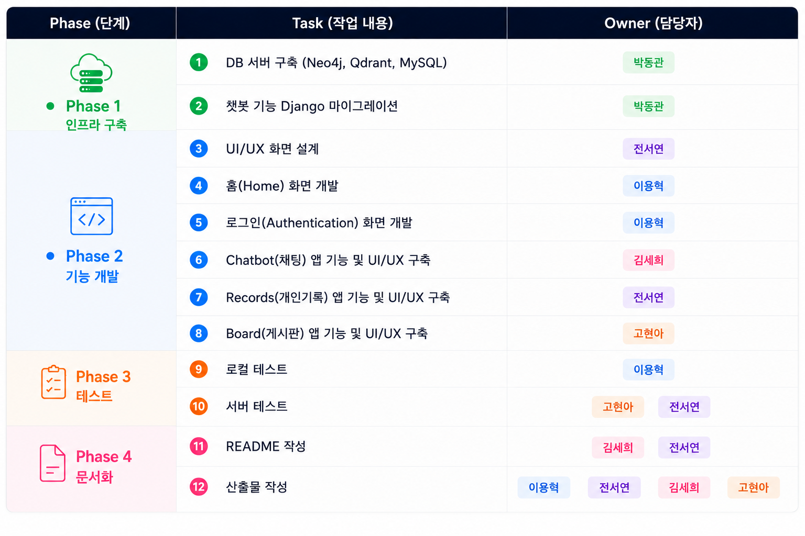

---

## 2. 프로젝트 개요

### 2-1. 프로젝트 소개
진격의 박병장은 군 장병에게 필요한 정보를 쉽고 빠르게 제공하기 위한 **LLM 기반 군 생활 지원 웹 애플리케이션**입니다.

군 관련 AI 챗봇과 회원 관리, 개인 기록, 익명 게시판 기능을 제공하며, Django와 AWS를 활용해 실제 서비스 형태로 구현했습니다.

### 2-2. 주제 선정 이유 및 목표

3차 프로젝트에서는 군 관련 법령과 병영생활 정보를 제공하는 RAG 기반 AI 챗봇을 개발했습니다.

4차 프로젝트에서는 사용자의 지속적인 서비스 활용을 위해 기존 AI 챗봇을 중심으로 다음 기능을 추가하고, Django 기반 웹 애플리케이션으로 확장했습니다.

- 회원 관리
- 개인 기록 (D-day · 캘린더 · 목표)
- 익명 게시판

또한 AWS에 배포하여 실제 사용 가능한 군 생활 지원 서비스를 구축하는 것을 목표로 프로젝트를 진행했습니다.
  

---

## 3. 주요 기능

3차 프로젝트에서는 **LLM 기반 RAG 챗봇** 구현에 초점을 맞췄다면,
4차 프로젝트에서는 기존 챗봇을 기반으로 실제 사용 가능한 **군 생활 통합 웹 애플리케이션**으로 확장했습니다.

> 

| 기능 | 설명 |
|---|---|
| 🏠 **Home** | 서비스 소개 · 전역 D-day · 주요 기능 바로가기 |
| 👤 **User** | 회원가입 · 로그인 · 계급 기반 맞춤 서비스 |
| 🤖 **AI Chatbot** | 실시간 스트리밍 · 대화 저장 · 이전 대화 관리 |
| 📝 **Record** | 전역 D-day · 캘린더 · 목표 관리 |
| 👥 **Community** | 익명 게시판 · 댓글 · 좋아요 · 검색 |
| ☁️ **Deployment** | Django 기반 웹 서비스 · AWS EC2 · AWS RDS |

---

## 4. 기술 스택

| Layer | Technology |
|------|------------|
| **Language** |  |
| **Frontend** |    |
| **Backend** |  |
| **AI / RAG** |    |
| **Database** |    |
| **Infrastructure** |     |

---

## 5. 프로젝트 구조 

```text
SKN31-4th-2Team
├── military_life
│   ├── account/              # 회원가입, 로그인 및 사용자 관리
│   ├── back_logic/           # RAG 검색 및 AI 챗봇 로직
│   │   ├── chatbot.py
│   │   ├── graphdb_retriever.py
│   │   ├── vectordb_retriever.py
│   │   └── tools.py
│   │
│   ├── board/               # 익명 게시판 기능
│   ├── chatbot/             # 챗봇 앱
│   │   ├── migrations/
│   │   ├── static/
│   │   ├── templates/
│   │   ├── admin.pys
│   │   ├── models.py
│   │   ├── urls.py
│   │   └── views.py
│   │
│   ├── config/              # Django 프로젝트 설정
│   │   ├── settings.py
│   │   ├── urls.py
│   │   ├── asgi.py
│   │   └── wsgi.py
│   │
│   ├── home/                # 메인(Home) 페이지
│   ├── records/             # 개인 기록(D-day, 캘린더, 목표)
│   ├── static/              # CSS, JavaScript, 이미지, 폰트
│   ├── templates/           # 공통 HTML 템플릿
│   ├── images/              # README 이미지
│   ├── manage.py
│   ├── requirements-linux.txt
│   └── deploy.sh
│
├── README.md
├── requirements-linux.txt
└── requirements-test.txt
```
---

## 6. 시스템 아키텍처
<p align="center">
    

</p>


## 7. 배포 정보
### AWS EC2 URL

| 구분 | URL |
|------|-----|
| 🏠 서비스 | http://43.200.132.171
| 🔑 Admin | http://43.200.132.171/admin |

> **배포 환경:** AWS EC2 (Ubuntu 24.04 LTS) + AWS RDS(MySQL)

---

## 8. 화면 설계
### 8-1. 홈화면
서비스 소개, 전역 D-Day, 복무 진행률과 주요 기능 바로가기를 한눈에 확인하는 메인 화면
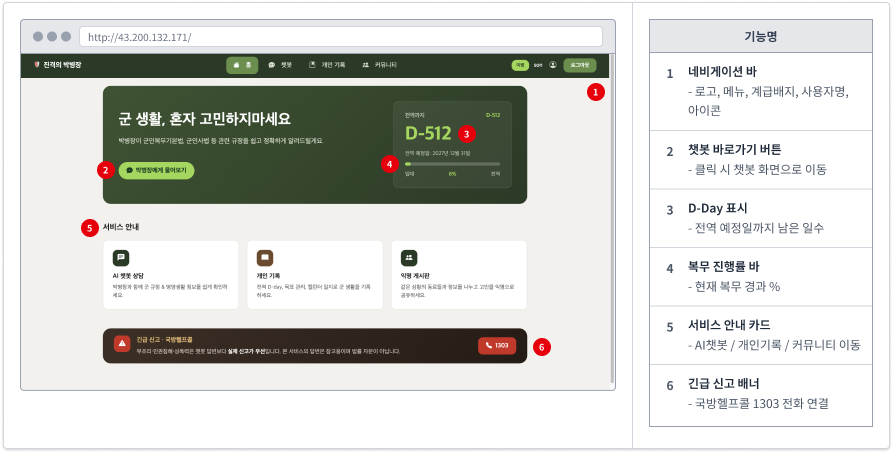

### 8-2. 로그인
아이디와 비밀번호를 입력해 로그인하고, 회원가입 탭으로 전환할 수 있는 화면
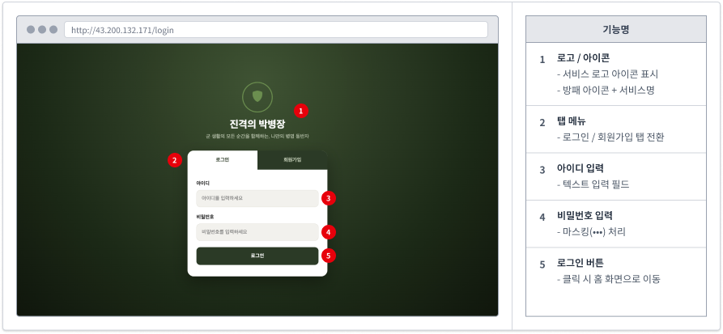

### 8-3. 회원가입
아이디·이메일·비밀번호와 입대일, 신분(병사/간부)·계급을 입력해 계정을 생성하는 화면
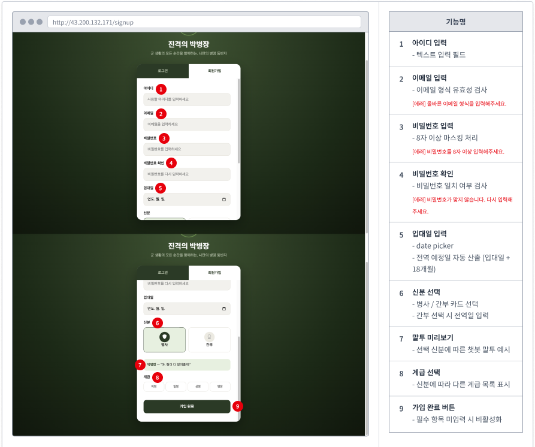

### 8-4-1. 개인기록: D-day
전역까지 남은 일수(D-Day)와 전역 예정일, 복무 진행률·통계를 확인하는 화면
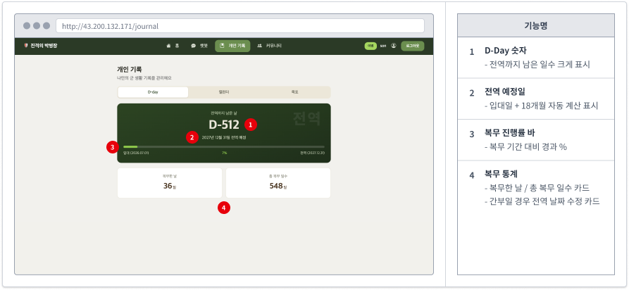

### 8-4-2. 개인기록: 캘린더
월별 캘린더에서 휴가·외박 등 일정을 등록하고 조회하는 화면
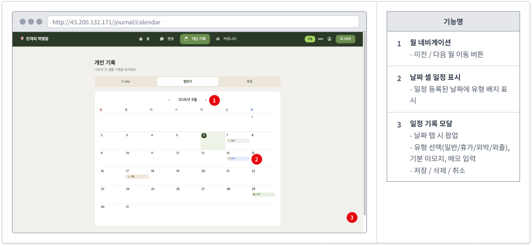

### 8-4-3. 개인기록: 목표
카테고리별 목표를 추가하고 달성률·목표일을 관리하는 화면
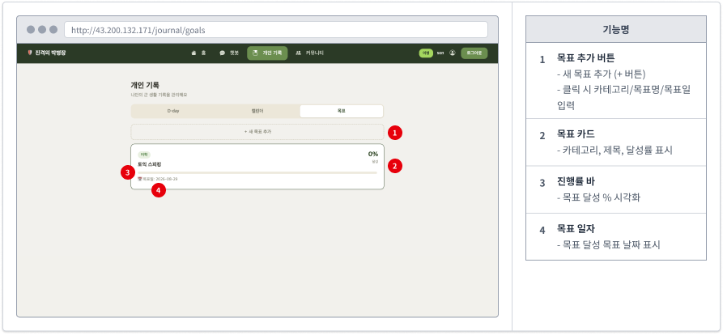

### 8-5-1. 커뮤니티: 게시판
카테고리별 게시글을 검색·열람하고 새 글을 작성할 수 있는 익명 게시판 목록 화면
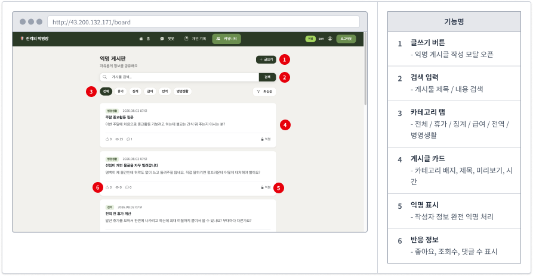

### 8-5-2. 커뮤니티: 게시글
게시글 본문과 댓글을 확인하고 좋아요·댓글 작성·신고가 가능한 게시글 상세 화면
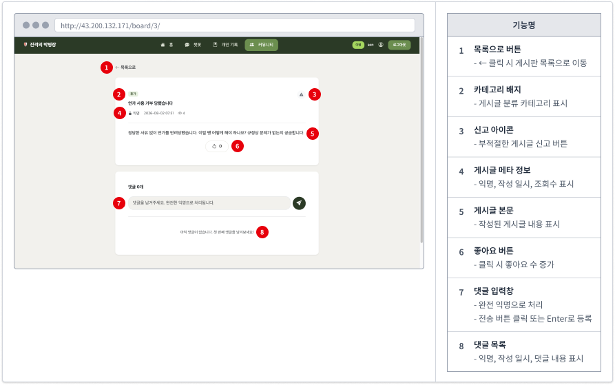

### 8-6. 회원 정보 수정
아이디·비밀번호·신분·계급 등 회원 정보를 수정하거나 탈퇴할 수 있는 화면
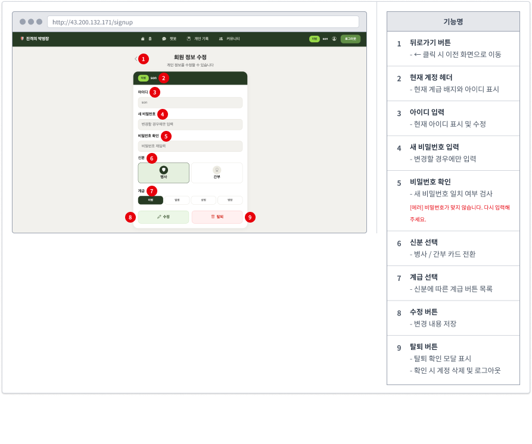

### 8-7. 내가 쓴 게시글
본인이 작성한 게시글 목록을 확인하고 삭제할 수 있는 화면
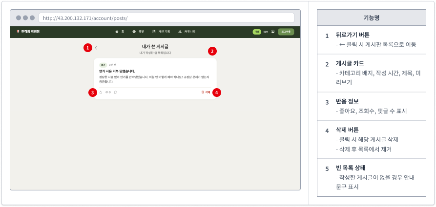

---

## 9. 프로젝트 산출물

프로젝트 진행 과정에서 작성한 주요 산출물입니다.

| 산출물 | 자세히 보기 |
|--------|------|
| 📋 **요구사항 정의서** | [⌜요구사항 정의서⌟](산출물/요구사항_정의서.md) |
| 🧮 **테이블 정의서** | [⌜테이블 정의서⌟](산출물/테이블_정의서.md) |
| 🎨 **화면 설계서** | [⌜화면 설계서](산출물/화면_설계서.md) |
| 🏗 **시스템 구성도** | [⌜시스템 구성도⌟](산출물/시스템_구성도.md) |
| 🧪 **테스트 계획서 및 테스트 결과 보고서** | [⌜테스트 계획서⌟](산출물/.md) , [⌜테스트 결과 보고서⌟](산출물/.md) |

---

## 10. 한줄 회고
### 전서연
      이번 프로젝트는 확장 서비스 개발과 3차 프로젝트를 Webapp 구조로 전환하는 작업부터 시작했습니다. 구조 변경을 차근차근 진행한 뒤, 화면 설계와 Records 앱의 D-day·캘린더·목표 관리 기능을 구현하고 서버 테스트까지 하나씩 마무리해 나갔습니다. 수업에서 배운 내용을 직접 실습에 적용해 보면서, 로컬 환경이 아닌 실제 서버에서 프로젝트가 동작하는 모습을 보니 신기하기도 했습니다.
      처음으로 팀장을 맡아 부담도 있었지만, 팀원들이 잘 따라와 준 덕분에 큰 어려움 없이 마무리할 수 있었고, 값진 경험이었습니다! 
### 고현아
      프로젝트를 실제 서버에 배포하고 결과물이 정상적으로 동작하는 모습을 직접 확인하니 큰 성취감을 느낄 수 있었습니다. 개발 과정에서 모듈 인식 문제나 템플릿 문법 오류 등 다양한 실행착오를 겪으며 끊임없이 에러를 해결해야 했습니다. 복잡하고 어렵게 느껴졌던 Django와 AWS 환경이었지만, 끝내 원인을 찾아내고 무사히 서버를 구동시킬 수 있어 다행이고 보람찹니다. 여기서 얻은 값진 경험을 바탕으로, 다음 파이널 프로젝트에서는 한층 더 성장하여 프로젝트에 실질적인 보탬이 되겠습니다.

### 김세희
      이번 4차 프로젝트에서는 기존 챗봇을 웹 애플리케이션으로 확장하면서 수업에서 배운 다양한 기능을 직접 구현해볼 수 있어 의미 있는 경험이었습니다. 특히 챗봇 UI를 개선하는 과정에서 여러 파일이 서로 연동되는 구조를 직접 다뤄보며 Django의 동작 방식을 더 잘 이해할 수 있었습니다. 또한 AWS를 활용해 서비스가 배포되는 과정을 보면서 실제 운영 환경으로 이어지는 흐름을 신기하고 재밌었습니다. 개인적으로는 프로젝트를 진행하며 여러 AI 도구를 상황에 맞게 효율적으로 활용하는 방법을 새롭게 시도해볼 수 있었던 점도 좋았습니다.
### 박동관
      기존에 로컬에서만 돌리던 프로젝트를 실제 서버에 올리면서 많은 걸 배웠습니다. DB까지 서버에 올리고 나니 팀원들과 로컬에서 작업할 때보다 훨씬 수월하게 협업할 수 있었습니다. 무엇보다 제가 만든 프로젝트에 다른 사람들도 직접 접속해서 써볼 수 있다는 게 신기하고 뿌듯했습니다. 배포 과정에서 겪은 시행착오들 덕분에 다음 프로젝트에서는 더 자신 있게 서버 작업을 할 수 있을 것 같습니다.
### 이용혁
      홈 화면과 로그인 화면을 개발하고 마지막에는 Playwright E2E 웹페이지 테스트를 담당했습니다.  팀원들이 개발한 서비스 화면과 산출물 보고서를 바탕으로 테스트 계획서를 작성했습니다. 테스트를 진행하고 결과보고서를 제출했습니다.  테스트를 통해 개발중에 놓쳤던 오류들을 수정하고 완성도를 높이는데 기여할 수 있어 보람이 있었습니다.

