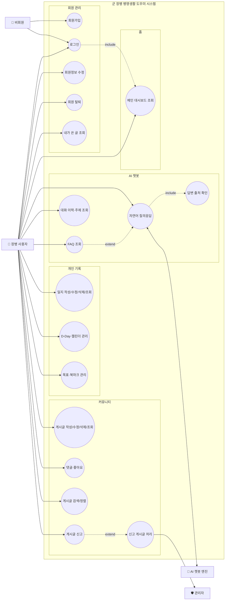
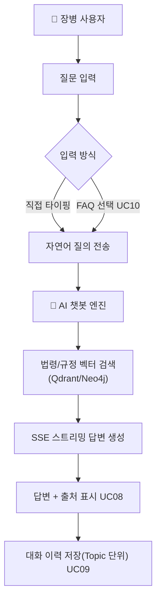

# 군 장병 병영생활 도우미 서비스 유즈케이스 명세서

> `요구사항_정의서.md`의 기능 요구사항(REQ-F-001 ~ 014)을 기준으로 작성한 유즈케이스 다이어그램 및 상세 명세입니다.
> 화면 흐름은 `화면설계서.md`의 사이트맵을 참고했습니다.

---

## 1. 액터(Actor) 정의

| 액터 | 구분 | 설명 |
|------|------|------|
| 비회원 (Guest) | Primary | 아직 로그인하지 않은 방문자. 로그인/회원가입 화면만 접근 가능 |
| 장병 사용자 (Member) | Primary | 회원가입 및 신분(병사/간부) 인증을 마친 로그인 사용자. 대부분의 유즈케이스의 주 행위자 |
| AI 챗봇 엔진 | Secondary (System) | LangChain/LangGraph + Qdrant/Neo4j 기반 RAG 파이프라인. 질의를 받아 법령·규정을 검색하고 SSE로 답변을 스트리밍 |
| 관리자 (Admin) | Secondary | Django Admin을 통해 신고된 게시글/댓글을 검토·처리하는 운영자 |

---

## 2. 유즈케이스 다이어그램

### 2-1. 전체 개요

### 2-2. AI 챗봇 상세 흐름 (REQ-F-004~007)

---

## 3. 유즈케이스 목록

| UC ID | 유즈케이스명 | 관련 요구사항 | 주 액터 | 개요 |
|-------|-------------|---------------|---------|------|
| UC-01 | 회원가입 | REQ-F-001 | 비회원 | 아이디/이메일/비밀번호/입대일/신분(병사·간부)/계급을 입력해 계정을 생성 |
| UC-02 | 로그인 | REQ-F-001 | 비회원 | 아이디/비밀번호로 인증 후 홈 또는 원래 요청 페이지(`next`)로 이동 |
| UC-03 | 회원정보 수정 | REQ-F-001 | 장병 사용자 | 비밀번호, 신분, 계급 등 정보를 수정 |
| UC-04 | 회원 탈퇴 | REQ-F-001 | 장병 사용자 | 2차 확인 후 계정을 삭제(비활성화) |
| UC-05 | 내가 쓴 글 조회 | REQ-F-002 | 장병 사용자 | 마이페이지에서 본인이 작성한 게시글 목록을 확인 |
| UC-06 | 메인 대시보드 조회 | REQ-F-003 | 장병 사용자 | 챗봇 바로가기, 전역 D-Day, 최근 기록, 인기 게시글을 한 화면에서 확인 |
| UC-07 | 자연어 질의응답 | REQ-F-004 | 장병 사용자, AI 챗봇 엔진 | 자연어 질문을 입력하면 SSE 스트리밍으로 실시간 답변을 받음 |
| UC-08 | 답변 출처 확인 | REQ-F-005 | 장병 사용자 | 챗봇 답변에 첨부된 참조 법령·행정규칙 출처를 확인 (UC-07에 포함) |
| UC-09 | 대화 이력·주제 조회 | REQ-F-006 | 장병 사용자 | 좌측 사이드바에서 과거 대화(Topic)를 조회/재개/삭제 |
| UC-10 | FAQ 조회 | REQ-F-007 | 장병 사용자 | 카테고리별 자주 묻는 질문 목록에서 질문을 선택해 바로 질의 (UC-07 확장) |
| UC-11 | 일지 작성/수정/삭제/조회 | REQ-F-008 | 장병 사용자 | 훈련/휴가/일상 등 유형과 감정 상태를 포함한 일지를 CRUD |
| UC-12 | D-Day·캘린더 관리 | REQ-F-009 | 장병 사용자 | 전역일 기준 D-Day 진행률과 월간 캘린더(휴가/외박/외출) 확인 |
| UC-13 | 목표·북마크 관리 | REQ-F-010 | 장병 사용자 | 군 생활 목표를 등록/관리하고 중요 기록을 북마크 |
| UC-14 | 게시글 작성/수정/삭제/조회 | REQ-F-011 | 장병 사용자 | 카테고리를 선택해 익명 게시글을 CRUD |
| UC-15 | 댓글·좋아요 | REQ-F-012 | 장병 사용자 | 게시글에 댓글을 작성/삭제하고 좋아요로 반응 |
| UC-16 | 게시글 검색/정렬 | REQ-F-013 | 장병 사용자 | 키워드 검색 및 최신순/인기순 정렬로 게시글 탐색 |
| UC-17 | 게시글 신고 | REQ-F-014 | 장병 사용자 | 부적절한 게시글/댓글을 신고 접수 |
| UC-18 | 신고 게시글 처리 | REQ-F-014 | 관리자 | 접수된 신고를 검토하고 게시글 노출 여부를 결정 (UC-17 확장) |

---

## 4. 상세 유즈케이스 명세

### UC-01. 회원가입

| 항목 | 내용 |
|------|------|
| 액터 | 비회원 |
| 트리거 | 로그인 화면에서 "회원가입" 탭 클릭 |
| 사전조건 | 로그인하지 않은 상태 |
| 기본 흐름 | 1) 아이디/이메일/비밀번호/비밀번호 확인/입대일을 입력한다. 2) 신분(병사/간부)을 선택한다. 3) 신분에 따라 동적으로 전환된 계급 목록에서 계급을 선택한다. 4) "가입 완료" 버튼을 클릭한다. 5) 시스템은 입력값을 검증하고 계정을 생성한 뒤 로그인 화면으로 이동시킨다. |
| 대안 흐름 | 3a) 신분을 "간부"로 바꾸면 계급 목록이 병사용에서 장교/부사관 그룹으로 즉시 전환된다(JS 토글). |
| 예외 흐름 | 4a) 아이디 중복, 비밀번호 불일치, 필수값 누락 시 오류 메시지를 표시하고 입력 화면에 머무른다. |
| 사후조건 | 신규 계정이 생성되며, 로그인 화면에서 즉시 로그인 가능한 상태가 된다. |

### UC-02. 로그인

| 항목 | 내용 |
|------|------|
| 액터 | 비회원 |
| 트리거 | 아이디/비밀번호 입력 후 "로그인" 클릭 |
| 사전조건 | 유효한 계정이 존재 |
| 기본 흐름 | 1) 아이디/비밀번호를 입력한다. 2) 시스템이 자격 증명을 검증한다. 3) 인증 성공 시 세션을 생성하고 `next` 파라미터가 있으면 해당 페이지로, 없으면 홈(UC-06)으로 이동한다. |
| 예외 흐름 | 2a) 자격 증명 불일치 시 오류 토스트를 표시하고 로그인 화면에 머무른다. |
| 사후조건 | 로그인 세션이 유지되며 전체 네비게이션(챗봇/개인기록/커뮤니티)에 접근 가능해진다. |

### UC-07. 자연어 질의응답

| 항목 | 내용 |
|------|------|
| 액터 | 장병 사용자, AI 챗봇 엔진 |
| 트리거 | 채팅 입력창에 질문을 입력 후 전송 |
| 사전조건 | 로그인 상태, 챗봇 화면(`/chatbot`) 접속 |
| 기본 흐름 | 1) 사용자가 자연어 질문을 입력하고 전송한다. 2) 챗봇 엔진이 질문을 분석해 법령/행정규칙 지식베이스(Qdrant/Neo4j)를 검색한다(검색 중 상태 표시). 3) 검색된 근거를 바탕으로 답변을 생성하며 SSE로 토큰 단위 스트리밍한다. 4) 답변 하단에 참조 출처를 함께 표시한다(UC-08, include). 5) 해당 대화가 Topic 단위로 저장된다(UC-09). |
| 대안 흐름 | 1a) 사용자가 FAQ 목록(UC-10)에서 질문을 클릭하면 동일 입력으로 간주해 2)부터 진행한다. |
| 예외 흐름 | 2a) 관련 근거를 찾지 못하면 "확인이 필요하다"는 안내와 함께 일반 안내 문구(법무관 상담 권유)를 반환한다. 3a) 스트리밍 중 연결이 끊기면 재시도 버튼을 노출한다. |
| 사후조건 | 대화 내역이 저장되어 이후 UC-09로 재조회 가능하다. |
| 비고 | REQ-N-001(3~5초 내 스트리밍 개시), REQ-N-003(전문용어 평문 설명) 비기능요구사항과 연결됨 |

### UC-11. 일지 작성/수정/삭제/조회

| 항목 | 내용 |
|------|------|
| 액터 | 장병 사용자 |
| 트리거 | 개인기록 화면에서 일지 작성 액션 |
| 사전조건 | 로그인 상태 |
| 기본 흐름 | 1) 일지 유형(훈련/휴가/일상 등)과 감정 상태를 선택한다. 2) 내용을 작성 후 저장한다. 3) 시스템이 일지를 목록에 반영한다. 4) 사용자는 기존 일지를 조회/수정/삭제할 수 있다. |
| 예외 흐름 | 2a) 필수 항목 누락 시 저장을 막고 안내 메시지를 표시한다. |
| 사후조건 | 작성/수정/삭제 결과가 즉시 목록에 반영된다. |

### UC-14. 게시글 작성/수정/삭제/조회

| 항목 | 내용 |
|------|------|
| 액터 | 장병 사용자 |
| 트리거 | 게시판 목록에서 "＋ 글쓰기" 클릭 |
| 사전조건 | 로그인 상태 |
| 기본 흐름 | 1) 모달에서 카테고리, 제목, 내용을 입력한다(작성자 정보는 완전 익명 처리). 2) "게시하기"를 클릭하면 게시글이 등록되고 목록에 반영된다. 3) 작성자 본인은 게시글 상세에서 수정/삭제 메뉴를 사용할 수 있다. |
| 예외 흐름 | 2a) 제목/내용/카테고리 누락 시 등록을 막는다. 3a) 작성자가 아닌 사용자에게는 수정/삭제 메뉴가 노출되지 않는다. |
| 사후조건 | 게시글이 등록·수정·삭제되며 조회수/목록이 갱신된다. |

### UC-17 / UC-18. 게시글 신고 및 처리

| 항목 | 내용 |
|------|------|
| 액터 | 장병 사용자(UC-17), 관리자(UC-18) |
| 트리거 | 게시글 상세에서 "⚠ 신고" 클릭 |
| 사전조건 | 로그인 상태(UC-17) |
| 기본 흐름 | 1) 사용자가 부적절한 게시글/댓글에 대해 신고 사유를 선택해 접수한다. 2) 시스템이 신고 내역을 저장한다. 3) 관리자가 Django Admin에서 신고 목록을 검토한다(UC-18). 4) 관리자가 게시글 노출 유지/숨김/삭제 여부를 결정한다. |
| 예외 흐름 | 1a) 동일 사용자가 동일 게시글을 중복 신고하면 재접수를 막는다. |
| 사후조건 | 신고 이력이 남고, 관리자 처리 결과에 따라 게시글 노출 상태가 변경될 수 있다. |

---

## 5. 관련 문서

- 기능 요구사항: [`요구사항_정의서.md`](요구사항_정의서.md)
- 화면 흐름/와이어프레임: [`화면설계서.md`](화면설계서.md)
- 애플리케이션/인프라 구성도: [`../architecture/django-app-architecture.md`](../architecture/django-app-architecture.md), [`../architecture/aws-architecture.md`](../architecture/aws-architecture.md)

---
*military_life · 유즈케이스 명세서 초안 · 2026-08-06 · 요구사항정의서(REQ-F-001~014) 및 구현된 화면 기준으로 작성*
