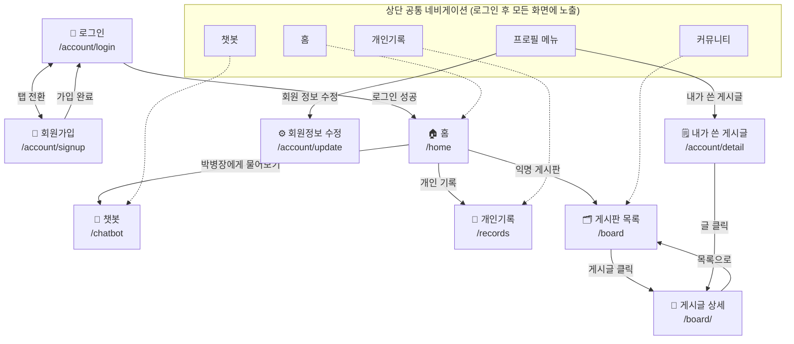

# 군 장병 병영생활 도우미 서비스 화면설계서

> `요구사항_정의서.md`의 기능 요구사항(REQ-F-001 ~ 014)을 기준으로,
> 실제 구현된 템플릿(`military_life/*/templates/`)을 바탕으로 그린 화면설계도(와이어프레임)입니다.
> 픽셀 단위 목업이 아닌 **레이아웃/영역/동작 흐름**을 보여주는 텍스트 와이어프레임입니다.

---

## 1. 사이트맵 (화면 흐름도)



**흐름 요약**
1. 미인증 사용자는 **로그인/회원가입**만 접근 가능하며, 로그인 성공 시 **홈**으로 이동한다.
2. 로그인 후에는 상단 네비게이션(홈/챗봇/개인기록/커뮤니티)과 우측 프로필 메뉴(회원정보 수정/내가 쓴 게시글)로 모든 화면을 오갈 수 있다.
3. 홈의 서비스 카드 3종(챗봇/개인기록/게시판)은 각 기능 화면의 진입점 역할을 한다.

---

## 2. 공통 레이아웃

### 2-1. 상단 네비게이션 바 (`base.html`)

```
┌──────────────────────────────────────────────────────────────────────────┐
│ 🛡️ 진격의 박병장   [홈] [챗봇] [개인기록] [커뮤니티]   [계급뱃지] user123 [👤▾][로그아웃]│
└──────────────────────────────────────────────────────────────────────────┘
        └ 클릭 시 프로필 드롭다운:
          ┌────────────────────┐
          │ ✏️  회원 정보 수정   │
          ├────────────────────┤
          │ 📄  내가 쓴 게시글   │
          └────────────────────┘
```
- 비로그인 상태에서는 우측 영역이 `[로그인] [회원가입]` 버튼으로 대체됨(REQ-F-001).
- 메시지(토스트) 발생 시 네비게이션 바로 아래에 알림 배너가 표시됨.

### 2-2. 인증 화면 공통 카드 (`base_auth.html`)

```
                ┌───────────────────────────┐
                │   [로그인]   회원가입      │  ← 탭 전환
                ├───────────────────────────┤
                │   아이디  [____________]   │
                │   비밀번호 [____________]   │
                │                           │
                │   [        로그인        ] │
                └───────────────────────────┘
```

---

## 3. 화면별 와이어프레임

### 3-1. 로그인 (`account/login.html`)

```
┌───────────────────────────────┐
│  [ 로그인 ]   회원가입          │
├───────────────────────────────┤
│  아이디   [______________]     │
│  비밀번호 [______________]     │
│                                │
│  [        로그인        ]      │
└───────────────────────────────┘
```
- REQ-F-001. `next` 파라미터로 로그인 후 원래 페이지로 리다이렉트.

### 3-2. 회원가입 (`account/signup.html`)

```
┌─────────────────────────────────────┐
│  로그인   [ 회원가입 ]                │
├─────────────────────────────────────┤
│ 아이디        [__________________]   │
│ 이메일        [__________________]   │
│ 비밀번호      [__________________]   │
│ 비밀번호 확인 [__________________]   │
│ 입대일        [__________________]   │
│                                       │
│ 신분   ( 🛡 병사 ) ( 🎖 간부 )          │
│ ┌───────────────────────────────┐   │
│ │ 박병장 — "야, 형이 다 알려줄게!" │   │  ← 신분에 따라 문구 변경(병사/간부)
│ └───────────────────────────────┘   │
│                                       │
│ 계급(병사)  ( 이병 )( 일병 )( 상병 )( 병장 )      │
│  └ 간부 선택 시 → 계급 그룹(장교/부사관 등)으로 전환 │
│                                       │
│ [          가입 완료          ]      │
└─────────────────────────────────────┘
```
- REQ-F-001. 신분(병사/간부) 선택에 따라 계급 선택 UI가 동적으로 전환됨(JS 토글).

### 3-3. 홈 (`home/index.html`)

```
┌──────────────────────────────────────────────────────────────┐
│ Hero                                                          │
│ ┌──────────────────────────────┐  ┌─────────────────────┐    │
│ │ 군 생활, 혼자 고민하지마세요    │  │ 전역까지     D-47   │    │
│ │ 박병장이 군인복무기본법 등을    │  │ D-47                │    │
│ │ 쉽고 정확하게 알려드려요        │  │ 전역 예정일: ...     │    │
│ │ [💬 박병장에게 물어보기]        │  │ [██████░░░░] 62%    │    │
│ │                                │  │ 입대        전역     │    │
│ └──────────────────────────────┘  └─────────────────────┘    │
│                                                                │
│ 서비스 안내                                                    │
│ ┌───────────┐ ┌───────────┐ ┌───────────┐                    │
│ │💬 AI 챗봇  │ │📔 개인 기록│ │👥 익명 게시판│                  │
│ │  상담      │ │            │ │             │                  │
│ └───────────┘ └───────────┘ └───────────┘                    │
│                                                                │
│ ⚠ 긴급 신고 · 국방헬프콜                          [☎ 1303]   │
│   부조리·인권침해·성폭력은 챗봇 답변보다 실제 신고가 우선      │
└──────────────────────────────────────────────────────────────┘
```
- REQ-F-003. D-day 카드, 서비스 바로가기 3종, 긴급신고 배너로 구성.

### 3-4. 챗봇 (`chatbot/chat.html`)

```
┌───────────────┬──────────────────────────────────────────────┐
│ [최근] 카테고리 │ 🤖 박병장          군 법규 및 병영생활 AI 상담  ● 온라인 │
│               ├──────────────────────────────────────────────┤
│ [＋ 새 채팅]   │                                                │
│               │  🤖 안녕! 나는 박병장이야. 휴가/징계/급여/전역   │
│ 최근 대화      │     뭐든 편하게 물어봐!            오전 10:12  │
│ ┌───────────┐ │                                                │
│ │대화1  오늘✕│ │                          나 · 오전 10:13 │
│ │대화2  최근✕│ │                    연가 일수 몇 일이에요? │
│ └───────────┘ │                                                │
│               │  🤖 (검색 중... 🔄 규정 검색 중)                │
│               │  🤖 연가는 복무기간에 따라 ...   오전 10:13    │
│               │                                                │
│               ├──────────────────────────────────────────────┤
│               │ [ 편하게 물어봐...______________ ] [➤ 전송]    │
│               │ AI 답변은 참고용입니다. 중요한 사안은 법무관에게│
└───────────────┴──────────────────────────────────────────────┘
```
카테고리 탭 전환 시:
```
│ 최근  [카테고리]
│ ▾ 휴가
│    · 연가 일수는 몇 일인가요?
│    · 청원휴가 신청 방법은?
│    · 외박과 외출의 차이는?
│ ▾ 징계 / ▾ 급여 / ▸ 전역   ← 클릭 시 질문 목록 펼침/접힘
```
- REQ-F-004~007. SSE 스트리밍(토큰 단위 출력), 검색 중 상태(tool_start/tool_end) 표시, 좌측 사이드바에서 대화이력 조회/삭제 및 FAQ 카테고리 제공. 모바일에서는 사이드바가 오버레이로 전환.

### 3-5. 개인 기록 (`records/records.html`)

```
┌──────────────────────────────────────────────────────────┐
│ 개인 기록                                                  │
│ 나만의 군 생활 기록을 관리해요                              │
│                                                            │
│ [ D-day ] [ 캘린더 ] [ 목표 ]   ← 탭 메뉴                  │
├──────────────────────────────────────────────────────────┤
│ [D-day 탭]                                                │
│  ┌────────────────────────────┐                          │
│  │ 전역까지 남은 날      D-120  │                          │
│  │ 2026-12-01 전역 예정         │                          │
│  │ [███████░░░░░░░] 62%        │                          │
│  │ 입대(...)   62%   전역(...)  │                          │
│  └────────────────────────────┘                          │
│  ┌──────────────┐ ┌──────────────┐                       │
│  │복무한 날 205일│ │총 복무일수 550일│                     │
│  └──────────────┘ └──────────────┘                       │
├──────────────────────────────────────────────────────────┤
│ [캘린더 탭]                                    ● 외박 3회 │
│  ‹  2026년 8월  ›                                         │
│  일 월 화 수 목 금 토                                      │
│  ┌──┬──┬──┬──┬──┬──┬──┐                                  │
│  │  │  │  │..오늘..│  │  │  │  ← 날짜 클릭 → 일정 기록 모달│
│  │휴가│외박│외출│일반 ...                                  │
│  └──┴──┴──┴──┴──┴──┴──┘                                  │
│  범례: 휴가 / 외박 / 외출 / 일반                            │
├──────────────────────────────────────────────────────────┤
│ [목표 탭]                                                 │
│  [＋ 새 목표 추가]                                         │
│   └ 클릭 시 폼 펼침: 카테고리 / 목표명 / ...                │
└──────────────────────────────────────────────────────────┘
```
- REQ-F-008~010. 탭 전환형 SPA-like UI(D-day / 캘린더 / 목표), 캘린더는 월 단위 네비게이션 및 날짜별 기록(휴가/외박/외출) 태그 표시.

### 3-6. 커뮤니티 게시판 목록 (`board/post_list.html`)

```
┌──────────────────────────────────────────────────────────┐
│ 익명 게시판                                  [＋ 글쓰기]   │
│ 같은 상황의 동료들과 정보를 공유해요                        │
│                                                            │
│ [🔍 게시물 검색...______________] [검색]                   │
│ [전체] [부대생활] [휴가팁] [진로상담] ...  ← 카테고리 칩     │
├──────────────────────────────────────────────────────────┤
│ ┌────────────────────────────────────────────────────┐   │
│ │ [부대생활]                              3시간 전     │   │
│ │ 신병 때 꼭 알아야 할 것들                            │   │
│ │ 이등병 때 헷갈렸던 부분 정리해봤습니다...             │   │
│ │ 👍12  👁 84  💬 5                       🔒 익명       │   │
│ └────────────────────────────────────────────────────┘   │
│  (게시글 카드 반복)                                        │
└──────────────────────────────────────────────────────────┘

  [＋ 글쓰기] 클릭 시 모달:
  ┌───────────────────────────────┐
  │ 익명 글쓰기                 ✕ │
  │ 카테고리 ( ) ( ) ( ) ( )       │
  │ 제목    [__________________]  │
  │ 내용    [                  ]  │
  │         [                  ]  │
  │ 🔒 작성자 정보는 완전 익명 처리 │
  │        [취소]      [게시하기]  │
  └───────────────────────────────┘
```
- REQ-F-011, 013. 카테고리 필터 + 키워드 검색, 모달 기반 글쓰기.

### 3-7. 게시글 상세 (`board/post_detail.html`)

```
┌──────────────────────────────────────────────────────────┐
│ ← 목록으로                                                 │
│ ┌────────────────────────────────────────────────────┐   │
│ │ [부대생활]                                            │   │
│ │ 신병 때 꼭 알아야 할 것들                              │   │
│ │ 🔒 익명 · 3시간 전 · 👁 84            [⚠신고][⋮수정/삭제]│   │
│ │                                                        │   │
│ │ (게시글 본문 내용...)                                  │   │
│ │                                                        │   │
│ │            [👍 좋아요  12]                             │   │
│ └────────────────────────────────────────────────────┘   │
│ ┌────────────────────────────────────────────────────┐   │
│ │ 댓글 5개                                              │   │
│ │ [댓글을 남겨주세요...________________] [등록]          │   │
│ │ ──────────────────────────────                       │   │
│ │ 🔒 익명 · 1시간 전 전                        [🗑삭제]  │   │
│ │   댓글 내용...                                        │   │
│ │  (댓글 반복)                                          │   │
│ └────────────────────────────────────────────────────┘   │
└──────────────────────────────────────────────────────────┘
```
- REQ-F-012, 014. 좋아요/댓글/신고, 작성자 본인일 때만 수정·삭제 드롭다운 노출.

### 3-8. 마이페이지 — 회원 정보 수정 (`account/update.html`)

```
┌──────────────────────────────────────────────────────────┐
│ ‹  회원 정보 수정                                          │
│    개인 정보를 수정할 수 있습니다                          │
├──────────────────────────────────────────────────────────┤
│ [계급뱃지] user123                                         │
│ 아이디        [ user123 (수정불가) ]                       │
│ 새 비밀번호   [_______________]                            │
│ 비밀번호 확인 [_______________]                            │
│ 신분  ( 🛡 병사 ) ( 🎖 간부 )   ← 선택에 따라 계급 패널 전환 │
│ 계급  ( 이병 )( 일병 )( 상병 )( 병장 )                       │
├──────────────────────────────────────────────────────────┤
│           [✏ 수정]              [🗑 탈퇴]                  │
└──────────────────────────────────────────────────────────┘
```
- REQ-F-001. 탈퇴 버튼은 confirm 다이얼로그로 2차 확인 후 처리.

### 3-9. 마이페이지 — 내가 쓴 게시글 (`account/detail.html`)

```
┌──────────────────────────────────────────────────────────┐
│ ‹  내가 쓴 게시글                                          │
│    내가 작성한 글 목록입니다                                │
├──────────────────────────────────────────────────────────┤
│ ┌────────────────────────────────────────────────────┐   │
│ │ [부대생활]                              2일 전       │   │
│ │ 신병 때 꼭 알아야 할 것들                             │   │
│ │ 이등병 때 헷갈렸던 부분 정리...                        │   │
│ │ 👍3  👁 40  💬 2                        [🗑 삭제]     │   │
│ └────────────────────────────────────────────────────┘   │
│  (작성 글 카드 반복, 없으면 "아직 작성한 게시글이 없습니다.") │
└──────────────────────────────────────────────────────────┘
```
- REQ-F-002. 게시글 클릭 시 상세로 이동, 삭제는 AJAX 처리 후 목록 새로고침.

---

## 4. 반응형 참고

- 챗봇 화면(3-4)은 `max-width: 760px`에서 좌측 사이드바가 오버레이(전체 화면 덮개)로 전환됨(`sidebar-collapsed` / `sidebar-overlay`).
- 그 외 화면은 Bootstrap 5 그리드 기반으로 카드가 세로로 재배치됨(공통 `common.css`).

## 5. 관련 문서

- 기능 요구사항: [`요구사항_정의서.md`](요구사항_정의서.md)
- 애플리케이션/인프라 구성도: [`../architecture/django-app-architecture.md`](../architecture/django-app-architecture.md), [`../architecture/aws-architecture.md`](../architecture/aws-architecture.md)

---
*military_life · 화면설계서(와이어프레임) 초안 · 2026-08-06 · 구현된 템플릿 기준으로 작성*
