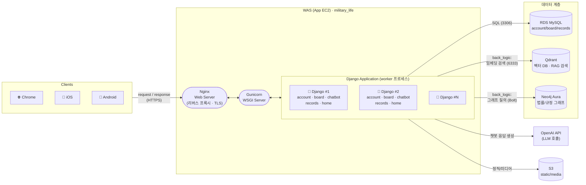

# military_life — Django Application Architecture

> 첨부 이미지(Nginx → Gunicorn → Django → DB)의 표준 WAS 구조를,
> `aws-architecture.md`에서 정의한 실제 배포 환경(App EC2 + RDS + Qdrant + Neo4j Aura + OpenAI)에
> 맞춰 구체화한 애플리케이션 아키텍처.

## 구성도

## 흐름 설명

1. **Clients → Nginx**: 브라우저/모바일 클라이언트가 HTTPS로 요청을 보내면 Nginx가 리버스 프록시 겸 TLS 종단(Let's Encrypt) 역할을 한다.
2. **Nginx → Gunicorn → Django**: Nginx는 정적 파일이 아닌 요청을 Gunicorn(WSGI 서버)에 전달하고, Gunicorn은 여러 Django 워커 프로세스에 요청을 분산한다. 각 워커는 `military_life` 프로젝트의 `account`, `board`, `chatbot`, `records`, `home` 앱을 동일하게 서빙한다.
3. **Django → 데이터 계층**: 일반 서비스 데이터(회원/게시판/기록)는 RDS MySQL에 저장하고, `chatbot`/`back_logic` 앱은 질의 시 Qdrant(벡터 유사도 검색)와 Neo4j Aura(법률·규정 간 관계 그래프)를 함께 조회해 RAG 파이프라인(LangChain/LangGraph)을 구성한다.
4. **Django → OpenAI API**: 검색된 컨텍스트(RAG 결과)를 바탕으로 OpenAI API를 호출해 최종 답변을 생성한다.
5. **Django → S3**: 정적 파일과 업로드된 미디어는 S3에 저장/서빙한다.

## 표준 구조와의 차이점

| 항목 | 첨부 이미지 (표준 WAS) | military_life 적용 |
|---|---|---|
| Web Server | Nginx | 동일 (+ Certbot TLS) |
| WSGI Server | Gunicorn | 동일 |
| Application | Django (단일 DB 연결) | Django + `back_logic`(RAG) 서브모듈 |
| Database Server | 단일 DB | RDS(MySQL) + Qdrant(벡터) + Neo4j Aura(그래프) 3계층 |
| 외부 연동 | 없음 | OpenAI API(LLM), S3(정적/미디어) 추가 |

## 관련 문서

- 인프라(AWS 배포) 관점 구성도: [`aws-architecture.md`](aws-architecture.md)

---
*military_life · Django Application Architecture 초안 · 2026-08-06*
