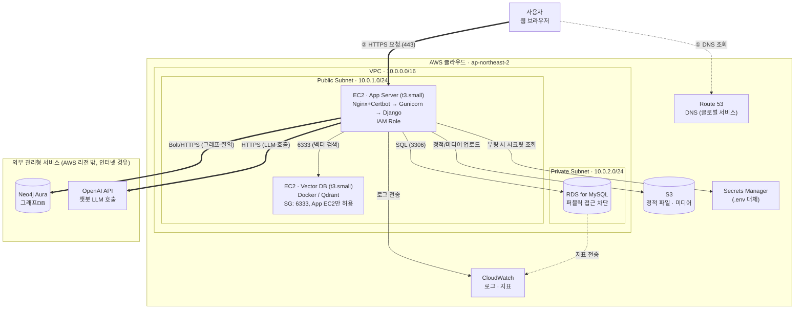

# military_life — AWS 배포 아키텍처 (v1)

> EC2 단일 인스턴스 기반 최소 구성. Qdrant는 같은 VPC의 별도 EC2에서 Docker로 직접 운영하고,
> Neo4j는 관리형 서비스인 Aura를 사용해 인프라 부담을 줄인다. App EC2가 퍼블릭 서브넷에 있어
> NAT Gateway 없이 외부 API(OpenAI, Neo4j Aura)를 호출할 수 있도록 구성해 비용을 낮췄다.

## 구성도

**흐름 설명**: 사용자 브라우저는 Route 53으로 도메인을 조회(①)한 뒤 실제 트래픽은 App EC2로 직접 전송(②)한다.
App EC2(Nginx→Gunicorn→Django)는 같은 퍼블릭 서브넷의 Qdrant EC2, 프라이빗 서브넷의 RDS MySQL과 통신하고,
IAM Role로 S3·Secrets Manager·CloudWatch에 접근한다. Neo4j Aura와 OpenAI API는 AWS 외부 관리형 서비스로,
퍼블릭 서브넷의 아웃바운드 인터넷 경로를 통해 직접 호출한다(NAT Gateway 불필요).

## 구성 요소별 역할

| 구성 요소 | 역할 | 비고 |
|---|---|---|
| EC2 · App Server | Nginx(리버스 프록시 + Let's Encrypt TLS) → Gunicorn → Django(military_life) 서빙 | t3.small 권장 |
| EC2 · Vector DB | Docker로 Qdrant 컨테이너 실행, App EC2의 챗봇 RAG 검색 처리 | SG: 6333, App EC2만 허용 |
| RDS for MySQL | account/board/records 등 서비스 도메인 데이터 저장 | 프라이빗 서브넷, 퍼블릭 접근 차단 |
| Neo4j Aura | 법률/규정 간 관계를 그래프로 질의 (관리형 클라우드, AWS 외부) | Bolt/HTTPS |
| S3 | 정적 파일(static) 배포 및 업로드 미디어 저장 | IAM Role 접근 |
| Secrets Manager | .env에 두던 OPENAI_API_KEY, DB 비밀번호 등을 코드 밖에서 관리 | CLAUDE.md 5번 원칙 대응 |
| CloudWatch | EC2/RDS 로그·지표 수집, 임계치 알람 | 장애 조기 탐지 |
| Route 53 | 도메인 DNS 관리 | 글로벌 서비스 |

## 이후 트래픽이 늘어날 때 고려할 점

- **ALB + ACM 도입** — 지금은 EC2에서 Certbot으로 TLS를 직접 처리하지만, 인스턴스를 늘리게 되면 로드밸런서가 SSL 종료와 헬스체크를 맡는 편이 관리하기 쉬움.
- **RDS Multi-AZ** — 현재는 단일 AZ 구성이라 RDS 장애 시 서비스가 중단됨. 실사용자가 늘면 Multi-AZ로 전환 검토.
- **Qdrant/Neo4j 백업** — Qdrant는 EC2 EBS 스냅샷을 주기적으로 남겨야 하고, Neo4j Aura는 자체 백업 정책을 확인해둘 것.
- **Auto Scaling** — 단일 EC2는 배포 중 다운타임이 생김. 트래픽이 늘면 ECS/Auto Scaling Group으로 이전 고려.

---
*military_life · AWS 구성 초안 · 2026-08-06*
